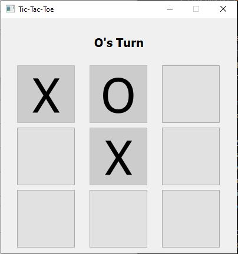
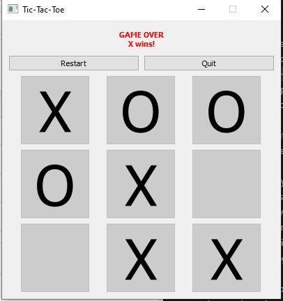

# Tic-Tac-Toe (GUI version)
A graphical Tic-Tac-Toe game built using Python and PyQt5.

This version upgrades the classic console implementation into a fully interactive desktop application.

## Features
- 3x3 clickable game board (QGridLayout)
- Turn indicator label (X / O)
- Automatic win / draw detection
- Restart button, Quit button(appears after game ends)

## What I Learned
- GUI development with PyQt5
- Using QGridLayout, QVBoxLayout, QHBoxLayout
- Event-driven programming (.clicked.connect())
- Updating UI dynamically
- Structuring a GUI class cleanly

## Challenge
One of the trickiest parts of this project was understanding how to correctly connect buttons inside a loop:

btn.clicked.connect(lambda _, i=index: self.on_click(i))

I learned that:
- Qt’s .clicked.connect() requires a function reference.
- Using lambda allows passing arguments to a function.
- i=index is necessary to capture the current value of index inside the loop.
- Without it, all buttons would reference the same final index.

## How to Run
1. install PyQt5
2. Run tictactoe-GUI.py

## Demo

