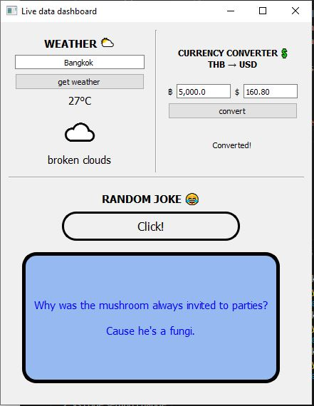

# Live Data Dashboard App

A PyQt5 desktop application that displays real-time data from multiple APIs:

- 🌤 Weather
- 💱 Currency Converter (THB → USD)
- 😂 Random Joke Generator

## Features
- Real-time API data
- Error handling for network issues
- Clean UI with PyQt5 layouts
- Multiple widgets combined in one dashboard

## What I Learned
- API integration using requests
- PyQt5 layout management
- Error handling (HTTP, connection, timeout)
- Basic UI/UX design

## How to Run
```bash
pip install -r requirements.txt
python main.py
```

## Demo

