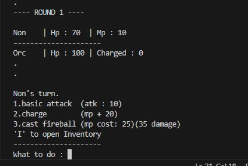
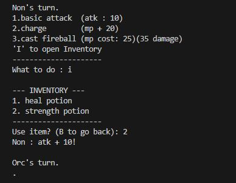

# RPG game

## what i learn
- learn to use super()
- try using enumerate(), isinstance()
- how to use **class and object** in python
- how to apply **inheritance**
- why seperaing files make code easier to manage

## Challenges

- Understanding when to use `super()` vs writing new methods
- Avoiding circular imports between files (Two files importing each other (player.py ↔ enemy.py) causes errors.)
- Designing enemy behavior without hard-coding (Use methods like enemy.take_turn() so each enemy decides its own action.)

## How to Run

Make sure Python is installed, then run:

```bash
python main.py

## Demo
 
